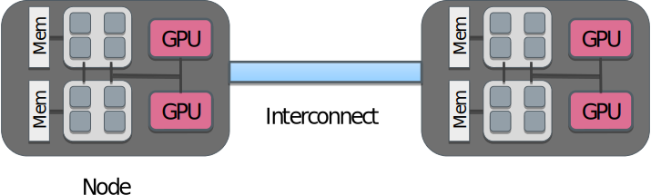
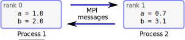
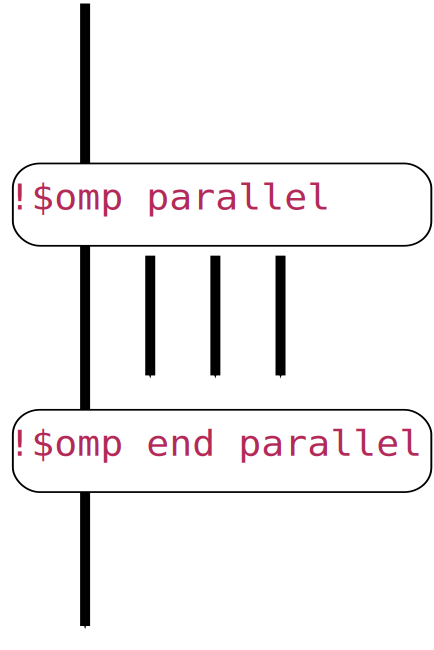
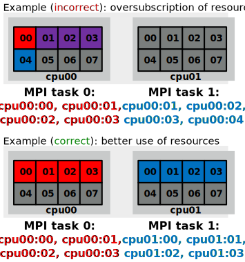
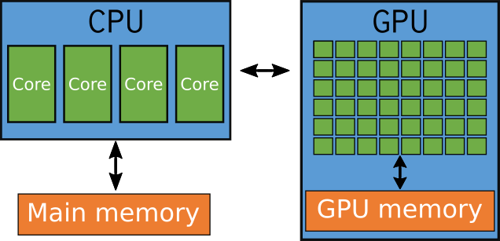

# Parallel programming {.section}

# Programming languages

- The de-facto standard programming languages in HPC are (still!)
  C/C++ and Fortran
- Higher level languages like Python and Julia are gaining popularity
    - Often computationally intensive parts are still written in C/C++
      or Fortran
- Low level GPU programming with CUDA or HIP
- Performance portability frameworks
    - SYCL, Kokkos
- High-level frameworks for special tasks
    - PETSc, Trilinos, TensorFlow, PyTorch

# Parallel programming models

{.center width=100%}

# Parallel programming models

- Parallel execution is based on threads or processes (or both) which run at the same time on different CPU cores
- Processes
    - Have their own state information and *own memory* address space
    - Interaction is based on exchanging messages between processes
    - MPI (Message passing interface)
- Threads
    - Share the memory address space
    - Interaction is based on shared memory, i.e. each thread can access directly other threads data
    - OpenMP, pthreads

# Parallel programming models

<!-- Copyright CSC -->
 {.center width=80%}
<div class=column>
**MPI: Processes**

- Independent execution units
- MPI launches N processes at application startup
- Works over multiple nodes
</div>
<div class=column>

**OpenMP: Threads**

- Threads share memory space
- Threads are created and destroyed  (parallel regions)
- Limited to a single node

</div>

# GPU programming models

- GPUs are co-processors to the CPU
- CPU controls the work flow:
  - *offloads* computations to GPU by launching *kernels*
  - allocates and deallocates the memory on GPUs
  - handles the data transfers between CPU and GPUs
- GPU kernels run multiple threads
    - Typically much more threads than "GPU cores"
- When using multiple GPUs, CPU runs typically multiple processes (MPI) or multiple threads (OpenMP)

# GPU programming models

{.center width=40%}
<br>

- CPU launches kernel on GPU
- Kernel execution is normally asynchronous
    - CPU remains active
- Multiple kernels may run concurrently on same GPU

# Brief introduction to MPI {.section}

# Message-passing interface

- MPI is an application programming interface (API) for distributed parallel
  computing
- MPI programs are portable and scalable
    - the same program can run on different types of computers, from
      laptops to supercomputers
- MPI is flexible and comprehensive
    - large (hundreds of procedures)
    - concise (only 10-20 procedures are typically needed)
- First version of standard (1.0) published in 1994, latest (4.0) in June 2021
    - <https://www.mpi-forum.org/docs/>

# Execution model in MPI

- Normally, parallel program is launched as a set of *independent*, *identical
  processes*
    - execute the *same program code* and instructions
    - processes can reside in different nodes (or even in different computers)
- The way to launch parallel program depends on the computing system
    - **`mpiexec`**, **`mpirun`**, **`srun`**, **`aprun`**, ...
    - **`srun`** on LUMI (and generally when using Slurm batch job system)
- MPI supports also dynamic spawning of processes and launching *different*
  programs communicating with each other
    - rarely used especially with DFT codes

# MPI ranks

<div class="column">
- MPI runtime assigns each process a unique rank (index)
    - identification of the processes
    - ranks range from 0 to N-1
- Processes can perform different tasks and handle different data based
  on their rank
</div>
<div class="column">
```fortran
integer :: a

if (rank == 0) then
   a = 1.0
   ...
else if (rank == 1) then
   a = 0.7
   ...
end if
...
```
</div>

# Data model

- All variables and data structures are local to the process
- Processes can exchange data by sending and receiving messages

{.center width=100%}

# MPI library

- Information about the communication framework
    - the number of processes
    - the rank of the process
- Communication between processes
    - sending and receiving messages between two or several processes
- Synchronization between processes
- Advanced features
    - Communicator manipulation, user defined datatypes, one-sided communication, ...


# Look and feel of a MPI program

```fortran
program mpi_example
  use mpi_f08
  ...
  call mpi_init(ierr)  ! Initialize MPI
  ! Query number of MPI tasks and rank
  call mpi_comm_size(MPI_COMM_WORLD, ntasks, ierr)
  call mpi_comm_rank(MPI_COMM_WORLD, rank, ierr)
  ...
  ! Send messages between two neighboring processes
  left = rank - 1
  right = rank + 1
  call mpi_sendrecv(sendbuf, 100, MPI_DOUBLE, left, tag,  &
    &               recvbuf, 100, MPI_DOUBLE, right, tag, &
    &               MPI_COMM_WORLD, status, ierr)
   ...
  ! Perform element-wise reduction over all MPI tasks
  call mpi_reduce(sendbuf, recvbuf, 100, MPI_DOUBLE, MPI_SUM, 0, MPI_COMM_WORLD, ierr)
   ...
```

# MPI summary

- In parallel programming with MPI, the key concept is a set of
  independent processes
- Data is always local to the process
- Processes can exchange data by sending and receiving messages
- The MPI library contains functions for communication and
  synchronization between processes


# Brief introduction to OpenMP {.section}

# What is OpenMP?

- A collection of _compiler directives_ and _library routines_ ,
  together with a _runtime system_, for
  **multi-threaded**, **shared-memory parallelization**
- Fortran 77/9X/0X and C/C++ are supported
- Latest version of the standard is 5.2 (November 2021)
    - Full support for accelerators (GPUs)
    - Support latest versions of C, C++ and Fortran
    - Support for a fully descriptive loop construct
    - and more
- Compiler support for 5.0 is still incomplete

# What is OpenMP

- OpenMP parallelized program can be run on your many-core workstation or on a
  node of a cluster
- Enables one to parallelize one part of the program at a time
    - Get some speedup with a limited investment in time
    - Efficient and well scaling code still requires effort
- Serial and OpenMP versions can easily coexist
- GPU programming with OpenMP offloading
- Pure OpenMP program is always limited to a single node
    - Combining with MPI allows to run hybrid MPI/OpenMP programs on multiple nodes


# Three components of OpenMP

- Compiler directives, i.e. language extensions
    - Expresses shared memory parallelization
    - Preceded by sentinel, can compile serial version

- Runtime library routines
    - Small number of library functions
    - Can be discarded in serial version via conditional compiling

- Environment variables
    - Specify the number of threads, thread affinity etc.

# OpenMP directives

- OpenMP directives consist of a *sentinel*, followed by the directive
  name and optional clauses
  <div style="padding-top:1em">

  |         | sentinel      | directive   | clauses          |
  | ------- | ------------- | ----------- | ---------------- |
  | C/C++   | `#pragma omp` | `parallel`  | `private(x,y)`   |
  | Fortran | `!$omp`       | `parallel`  | `private(x,y)`   |

  </div>
- Directives are ignored when code is compiled without OpenMP support


# OpenMP directives

<div class=column>
- In C/C++, a directive applies to the following structured block

```c++
#pragma omp parallel
{
  // calculate in parallel
    printf("Hello world!\n");
}
```
</div>

<div class=column>
- In Fortran, an `end` directive specifies the end of the construct

```fortran
!$omp parallel
  ! calculate in parallel
    write(*,*) "Hello world!"
!$omp end parallel
```
</div>

# Fork-join model

<div class="column">

- Threads are launched (forked) at the start of a *parallel region*
```fortran
  !$omp parallel [clauses]
     structured block
   !$omp end parallel
```
- Prior to it only one thread (main)
- Multiple threads execute the structured block
- After end only main thread continues executiona (join)

</div>
<div class="column">

- Single Program Multiple Data
{.center width=50%}

</div>


# Look and feel of an OpenMP program

```fortran
program openmp_example
  ...
! Calculate dot product of x and y in parallel
!$omp parallel do shared(x,y,n) private(i) reduction(+:asum)
  do i = 1, n
     asum = asum + x(i)*y(i)
  end do
!$omp end parallel do
```

# OpenMP summary

- OpenMP is an API for thread-based parallelisation in shared memory architectures
- Compiler directives, runtime API, environment variables
- Relatively easy to get started but specially efficient and/or real-world
  parallelisation non-trivial

# Process and thread affinity {.section}

# Process and thread affinity

- For obtaining parallel speedup, multiple CPU cores need to be executing 
  concurrently
- Process and thread are software constructs which operating systems maps to the 
  physical CPU cores
    - Operating system can even move a process/thread from one core to another
- Running more than single process/thread per core may cause significant performance
      penalty

# Controlling affinity


<div class="column" style="width:65%">
- MPI and OpenMP must be aware of each other for proper mapping of processes and threads
  to CPU cores
- Batch job schedulers may also affect mapping
- Heavily system dependent
    - At best, everything works out of the box
    - At worts, complex settings for MPI and OpenMP
</div>
<div class="column" style="width:30%">
{.center width=95%}
</div>
- See LUMI User Documentation for examples:
<small>
    - <https://docs.lumi-supercomputer.eu/runjobs/scheduled-jobs/distribution-binding/>
</small>


# Simultaneous multithreading

- Many Intel and AMD CPUs support simultaneous multithreading (SMT)
- When SMT is enabled, each physical core is seen as two logical cores by the 
  operating system (256 cores per node in LUMI)
- The two logical cores share most of the resources (arithmetic units, caches, memory bus)
    - Typically, performance benefit up to 30 % at best
- Well optimized HPC applications do not typically benefit from SMT
- Many HPC systems (including LUMI) have SMT turned off by default
    - Trying SMT is easy performance tuning opportunity

# GPU programming {.section}

# Introduction to GPUs

- GPUs have become ubiquitous in high-performance computing
- Better FLOPS / W than CPUs
    - LUMI CPU nodes: ~9 GLOPS / W
    - LUMI GPU nodes: ~85 GLOPS / W
- Single GPU provides high performance
    - Whole LUMI GPU partition = 20 000 GPUs
    - Whole LUMI CPU partition = 200 000 CPU cores
    - GPU partition has ~50 times more performance
- Currently, two players in the market: NVIDIA and AMD

# CPU vs GPU
<div class=column>
**CPU**

- More complex and oriented towards general purpose usage.
- Can run operating systems and very different types of applications
- Better control logic, caches and cache coherence
</div>
<div class=column>
**GPU**

- Large fraction of transistors dedicated to the mathematical operations and less to contorl and caching
- Individual core is less powerful, but there can be
thousands of them
</div>

# CPU vs GPU

<!-- Image source https://docs.nvidia.com/cuda/cuda-c-programming-guide/ 
     copyright  NVIDIA Corporation -->
{.center width=80%}

# GPU as co-processor

<div class=column>
- CPU and GPU have physically separate memories
    - Data needs to be copied via (slow) bus
- CPU controls the work flow:
  - *offloads* computations to GPU by launching *kernels*
  - allocates and deallocates the memory on GPUs
  - handles the data transfers between CPU and GPUs
</div>

<div class=column>
{.center width=85%}
</div>

# Programming for GPUs

- Porting application to GPUs is non-trivial
- Algorithms and data structures may need to be adapted (massive amount of parallelism required)
- The physical memory in current GPUs is distinct from CPUs
    - Memory copies between CPU and GPU can easily become bottlenect
- If only part of the application is ported, performance improvement may be modest

# GPU programming approaches

- Directive based approaches: OpenACC and OpenMP
    - "standard" and "portable"
- Native low level languages: CUDA (NVIDIA) and HIP (AMD)
    - HIP supports in principle also NVIDIA devices
    - Fortran needs wrappers via C-bindings
- Performance portability frameworks: SYCL, Kokkos
    - Support only C++
- Standard language features: parallel C++, `do concurrent`
    - Rely on implicit data movements
    - Compiler support incomplete

# OpenMP offloading

- OpenMP programming for GPUs is similar to normal OpenMP threading
- Directives specify which parts of the program are executed on GPUs and how they can
  be parallelized
- Additional directives and clauses for controlling data movement between CPU and GPU
- In principle offload target can be also multicore CPU
    - Same program can be run both on GPUs and CPUs
- Relatively simple programming, compiler and runtime take care of the details (in theory)

# Look and feel for OpenMP offloading

```fortran
program offload_example
  ...
! Calculate dot product of x and y in GPU
!$omp target  ! Offload following block to GPU with implicit data movements
!$omp teams distribute parallel do reduction(+:asum)
  do i = 1, n
     asum = asum + x(i)*y(i)
  end do
!$omp end teams distribute parallel do
!$omp end target
```

# CUDA/HIP programming

- CUDA/HIP add few additional constructs to standard C/C++
- Programming model: single instructions multiple threads (SIMT)
    - Programmer writes kernels that all the threads execute
- Threads are combined into groups (warps / wavefronts) which execute in lockstep
    - If statements in the kernels may be vary bad for performance

# Look and feel for CUDA/HIP

```c++
// Calculates y = y + a*x
__global__ void axpy_kernel(int n, float a, float *x, float *y)
{
    int tid = threadIdx.x + blockIdx.x * blockDim.x;

    if (tid < n) y[tid] += a * x[tid];
}

// x and y need to be "GPU" arrays
void axpy(int n, float a, float *x, float *y)
{
    dim3 blocks(32);
    dim3 threads(256);
    
axpy_kernel<<<blocks, threads>>>(n, a, x, y);
}
```

# Look and feel for CUDA/HIP

```c++
// Memory management
hipMalloc((void **) &x_gpu, sizeof(float) * n);
hipMemcpy(x_gpu, x, sizeof(float) * n, hipMemcpyHostToDevice);
...
hipMemcpy(y, y_gpu, sizeof(float) * n, hipMemcpyDeviceToHost);
```
```fortran
interface
  subroutine axpy_gpu(n, a, x, y) bind(C, name='axpy')
    use, intrinsic :: iso_c_binding
    type(c_ptr), value :: x, y
    real(c_float), value :: a
    integer(c_int), value :: n
  end subroutine
end interface
```

# Best practices for GPU programming (personal thoughts)

- Landscape for GPU programming is far from clear
- CUDA is in many ways a good approach
    - However, vendor lock in to NVIDIA
    - Automatic tools for "hipifying" CUDA core work quite well
- HIP supports in principle both AMD and NVIDIA devices
    - HIP environment is not necessarily available in NVIDIA based systems
    - No "cudafy" tool for going back to CUDA
- Header only portability approach
    - Write generic CUDA/HIP-like GPU code, the backend is chosen at compile time
    
# Best practices for GPU programming (personal thoughts)

- Directive based approaches promise good portability and performance
    - In principle, a key subroutines can be implemented in CUDA/HIP for better performance
    - Fortran is supported in the same level as C/C++
    - In practice, currently compilers have lot of room for improvement
- Kokkos and SYCL look promising
    - SYCL still largely driven by Intel
    - Require typical major rewriting of the program
    - Support only C++

# Best practices for porting to AMD GPUs (personal thoughts)

<div class=column>

- Existing CUDA code
    - Use "hipify" or try header-only porting library
- Existing OpenACC/OpenMP offload code
    - Cross your fingers and hope for the best

</div>
<div class=column>

- CPU-only C/C++ code
   - Write generic GPU code and use header-only porting library 
   - Try SYCL or Kokkos
- CPU-only Fortran code
   - Write generic GPU code with C together with header-only library and use C-bindings for interfacing to Fortran
   - Try OpenMP offloading

</div>


# Summary on GPU programming

- GPUs offer in theory a significant performance boost
- Programming can be more complicated
    - Memory copies between CPU and GPU
    - Large amount of parallelism needed
- Programming approaches:
    - OpenACC, OpenMP
    - HIP/CUDA
    - SYCL, Kokkos (C++ only)

# Web resources: MPI

- List of MPI functions with detailed descriptions
    - <https://rookiehpc.org/mpi/index.html>
    - <http://mpi.deino.net/mpi_functions/>
- Good online MPI tutorials
    - <https://hpc-tutorials.llnl.gov/mpi/>
    - <http://mpitutorial.com/tutorials/>
    - <https://www.youtube.com/watch?v=BPSgXQ9aUXY>
- MPI coding game in C
    - <https://www.codingame.com/playgrounds/47058/have-fun-with-mpi-in-c/lets-start-to-have-fun-with-mpi>

# Web resources: MPI

- MPI 4.0 standard <http://www.mpi-forum.org/docs/>
- MPI implementations
    - OpenMPI <http://www.open-mpi.org/>
    - MPICH <https://www.mpich.org/>
    - Intel MPI <https://software.intel.com/content/www/us/en/develop/tools/oneapi/components/mpi-library.html>

# Web resources: OpenMP

- OpenMP homepage: <http://openmp.org/>
- Good online reference: <https://rookiehpc.org/openmp/index.html>
- Online tutorials: <http://openmp.org/wp/resources/#Tutorials>

# Web resources: GPUs

- NVIDIA Training material: <https://developer.nvidia.com/cuda-education>
- AMD Training material: <https://rocm.docs.amd.com/en/latest/examples/all.html>
- HOP (HIP/CUDA portability library): <https://github.com/mlouhivu/hop>


