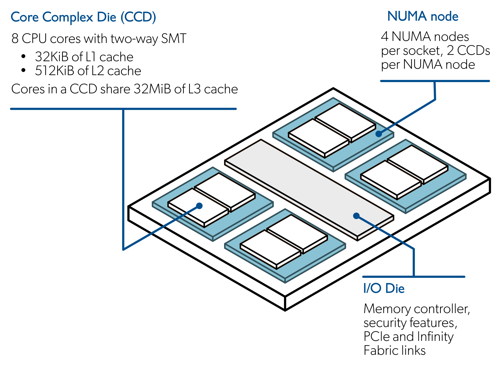
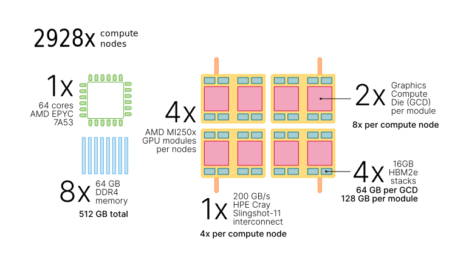

# Brief LUMI overview {.section}

# LUMI supercomputer

- LUMI is pan-European supercomputer funded by EuroHPC Joint Undertaking and the LUMI
  consortium
    - Finland, Sweden, Norway, Denmark, Iceland, Estonia, Belgium, Poland, Czech, Swittzerland
- CPU partition: ~1500 nodes with AMD 128 core CPUs
- GPU partition: ~3000 nodes, each with 4 AMD MI250X GPUs
    - Currently, the fastest system in Europe and 3rd in the world
- Hosted in CSC datacenter in Kajaani (~600 km north of Helsinki)

# LUMI CPU nodes

- Two CPUs per node
  - Base frequency 2.45 GHZ, turbo 3.5 GHz
  - Support 2-way SMT
- Each NUMA domain has 16 CPU cores
- Two memory channels assigned for each NUMA domain
    - Max bandwidth for NUMA domain 
- Single 200 Gb/s network link per node

{.center width=100%}
AMD EPYC CPU

# LUMI GPU nodes

- Four MI250X cards per node
    - Effectively 8 GPUs per node
- Four 200 Gb/s network links per node directly on GPUs

{.center width=100%}

